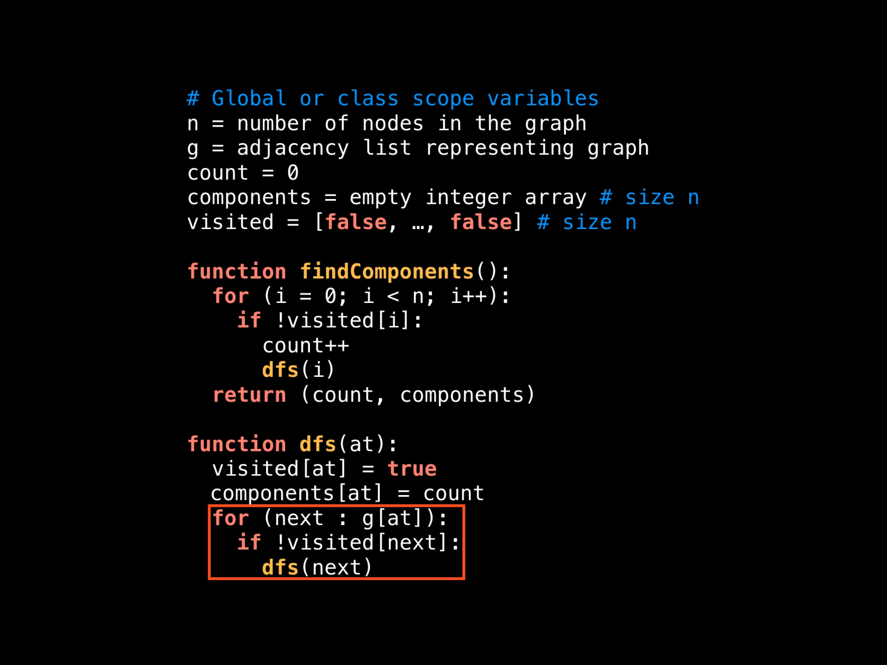
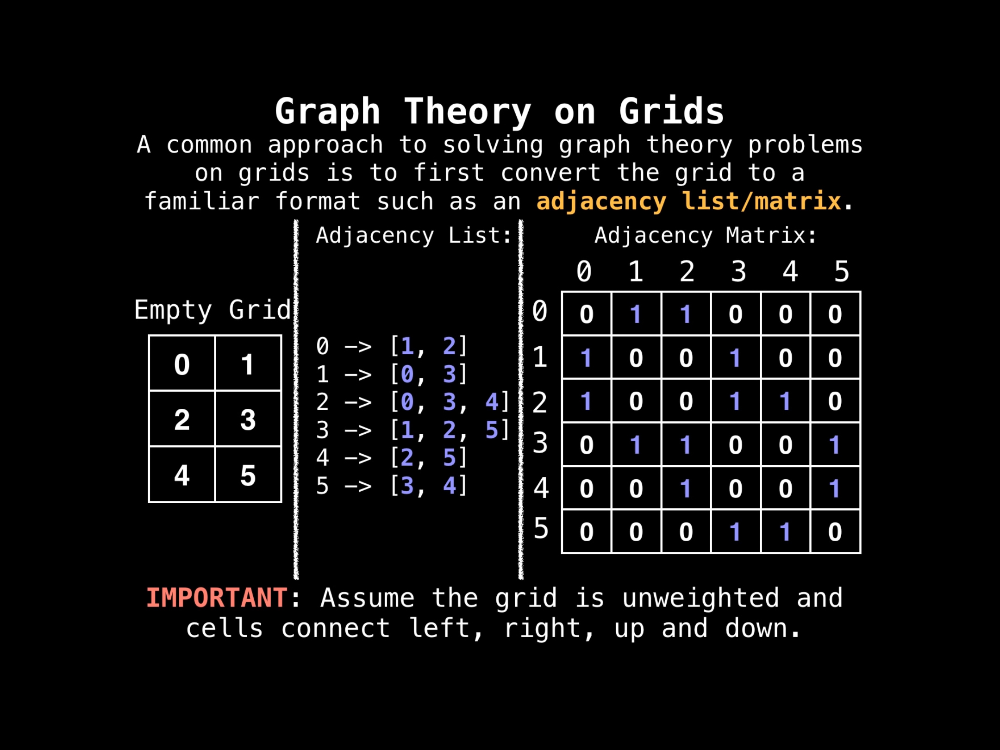
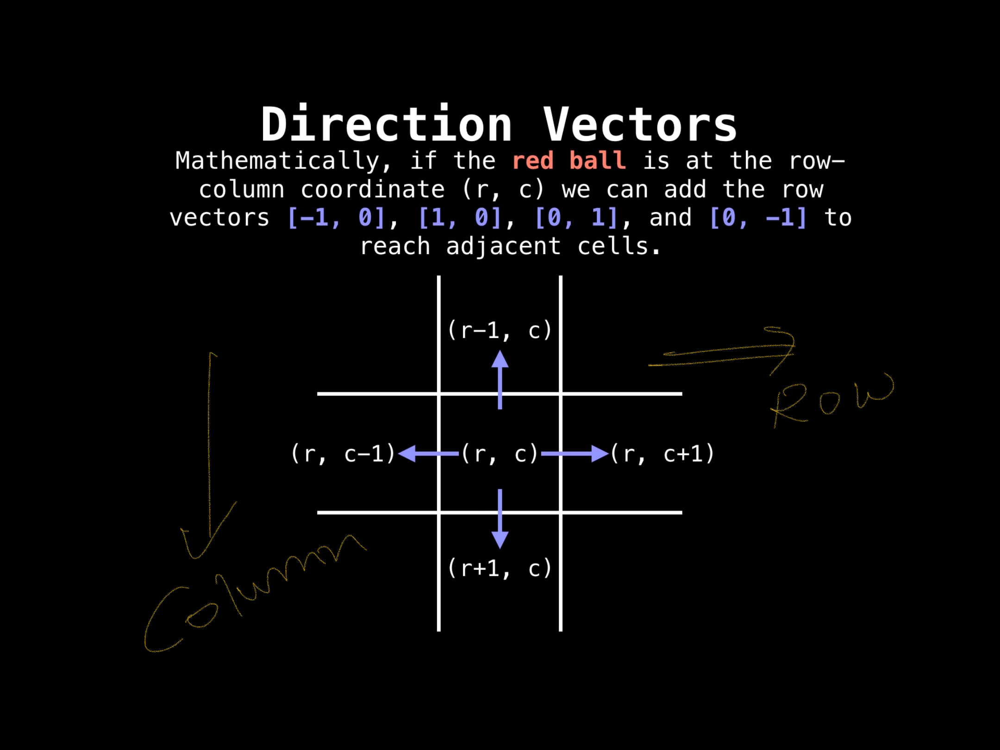
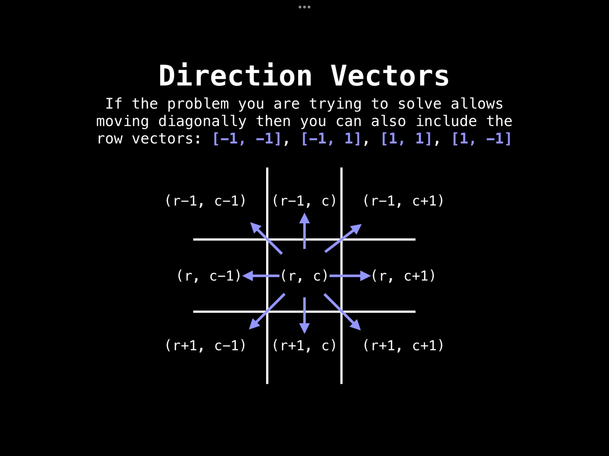
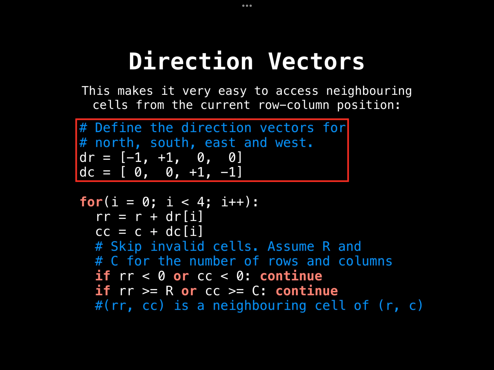

#### Graph

**Please note point 1 and 2 are explained via images and are documented at end of this document**

1. Ways to represent graph
- 1a. Adjacency Matrix
- 1b. Adjacency list - Please refer to adjacency list markdown.
- 1c. Edge list
2. Problems which can be solved with graphs
- 2a. Shortest path problem
- 2b. Connectivity
- 2c. Negative cycles
- 2d. Strongly connected graphs
- 2e. Travelling salesman problem
- 2f. Bridges
- 2e. Articulation points
- 2f. Minimum spanning tree
- 2e. Network flow: max flow
3. DFS
4. BFS 

#### 3. DFS
Usage: 
- Count connected components
- Determine connectivity
- Find bridges/articulation points
- Compute minimum spanning tree
- Detect and find cycles in graph
- Check if graph is bipartite
- Find strongly connected components
- Topologically sort nodes of graph
- Find bridges and articulation point
- Find augmenting paths in flow network
- Generate mazes

Time complexity:
- O(V+E)

Refer to 
- dfs using adjacency list
- dfs using adjacency matrix

#### 4. DFS - Find connected components
Logic: We maintain count variable, whenever we find any node which is not visited, we
increase count and run dfs on it.

#### 5. BFS 
Usage: 
- Finding the shortest path on unweighted graphs

Time complexity:
- O(V+E)

Refer to 
- bfs using adjacency list
- bfs using adjacency matrix

#### 6. BFS - Shortest path from start to end
- refer bfs shortest path adjacency list

#### 7. BFS - Shortest path from start to end

 
**But grid can be used as it is more efficiently**
 

 
**Grid traversal**
 

