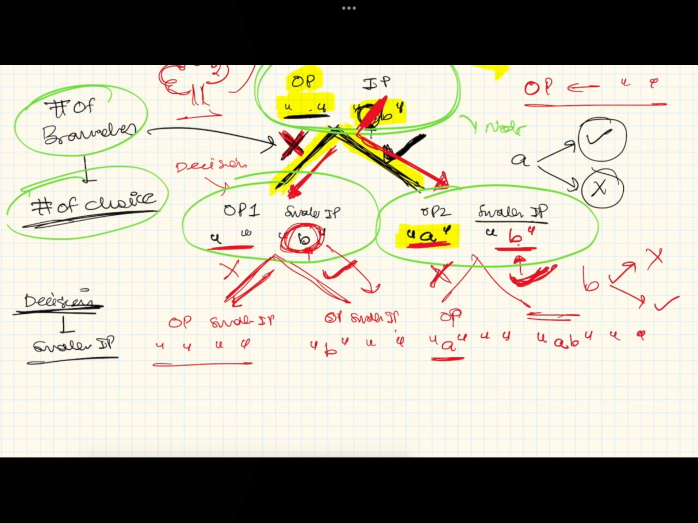

## **Recursion**
- It is not about making input smaller but taking decision at each point which can result in smaller input in next step
- If we can figure out recursion tree, which is representation of decisions in previous step
- Input-Output method



**2 steps to solve**
- **STEP 1** - 3 options 
1. **For easy problems** - If we are able to find out how to make input smaller - We can choose this approach
    - Base condition + induction + hypothesis
2. **For medium problems** - Design a recursion tree - Decision + (Decision + Choice) - Input-Output method or Extended input-output method
3. **For hard problems** - Choice diagram
- **STEP 2** - Write code

**Recursion - 15 problems on lcs pattern**
---
2 types
#### A. IBH method
#### A. Input-Output method
#### B. Extended input-output method

---
<br/>

#### A. IBH method
1. Print 1 to n/n to 1
2. Height of binary tree 
3. Sort an array
4. Sort a stack
5. Delete middle element in a stack
6. Reverse a stack
7. Kth symbol in grammar
8. Tower of hanoi

### From here onwards we will do Input-Output method
1. Print all subset, Print unique subsets
2. Permutations with space
3. Letter case permutations

#### B. Extended Input-Output method
1. Generate all balanced parentheses
2. Print N-bit binary numbers having more 1's than 0's for any prefix
3. Josephus problem/Execution

#### C. TODO
1. Binary string - # of 1's > # of 0's
2. Balanced parentesis
2. Count the # of occurence
5. Permutations with case change
7. Remove duplicate from string

</br>

**1. Print 1 to n/n to 1**
IBH - Solve with - Base condition + induction + hypothesis

**2. Height of binary tree**
IBH - Solve with - Base condition + induction + hypothesis

Base condition
If root == null
    return 0

Hypothesis
left_height = height(root.left)
right_height = height(root.right)

Induction 
height = 1 + Max(right_height, left_height)

**3. Sort an array**
</br>

Read code to understand how its done
```ruby
arr = [2, 5, 3, 4, 2, 1]

def sort(arr)
  if arr.length == 1
    return arr
  end

  *sort_arr, temp = arr
  sorted_arr = sort(sort_arr)
  arr = insert(sorted_arr, temp)
  return arr
end

def insert(arr, temp)
  if arr&.length == 0 || (arr&.last <= temp)
    arr.push(temp)
    return arr
  end

  *insert_arr, val = arr
  arr = insert(insert_arr, temp)
  arr.push val
  return arr
end

p sort(arr)

# >> [1, 2, 2, 3, 4, 5]
```

**3. Sort an stack**
```ruby
stack = Stack.new
stack.push(3)
stack.push(2)
stack.push(7)
stack.push(5)
stack.push(1)

def sort(stack)
  p ["stack", stack.size]
  if stack.size == 1
    return stack
  end

  temp = stack.pop
  sorted_stack = sort(stack)
  stack = insert(sorted_stack, temp)
  return stack
end

def insert(sorted_stack, temp)
  if sorted_stack&.size == 0 || (sorted_stack&.top <= temp)
    sorted_stack.push(temp)
    return sorted_stack
  end

  val = sorted_stack.pop
  stack = insert(sorted_stack, temp)
  stack.push val
  return stack
end

p sort(stack)
```

**5. Delete middle element in a stack**

</br>

Recall 

**6. Reverse a stack**
</br>

Problem statement: Reverse stack without using extra space

```ruby
class Stack
  attr_accessor :stack

  def initialize
    clear
  end

  def clear
    @stack = []
  end

  def size
    @stack.size
  end

  def empty?
    @stack.empty?
  end

  def push(value)
    @stack.push(value)
  end

  def pop
    return "Stack is empty" if size.zero?

    @stack.pop
  end

  def top
    @stack.last
  end

  def bottom
    @stack.first
  end

  def print
    return if stack.empty?
    while !stack.empty?
      puts @stack.pop
    end
  end
end

stack = Stack.new
stack.push(3)
stack.push(2)
stack.push(7)
stack.push(5)
stack.push(1)

def reverse(stack)
  if stack.size == 1
    return stack
  end

  temp = stack.pop
  reversed_stack = reverse(stack)
  stack = insert(reversed_stack, temp)
  return stack
end

def insert(sorted_stack, temp)
  if sorted_stack&.size == 0
    sorted_stack.push(temp)
    return sorted_stack
  end

  val = sorted_stack.pop
  stack = insert(sorted_stack, temp)
  stack.push val
  return stack
end

p stack
p reverse(stack)

# >> #<Stack:0x00007fc8690ef310 @stack=[3, 2, 7, 5, 1]>
# >> #<Stack:0x00007fc8690ef310 @stack=[1, 5, 7, 2, 3]>
```

#### **7. Kth symbol in grammar**
</br>

**Problem statement:**

0 - 0 1
1 - 1 0 

k = 1 and n = 1 => 0

k-----> 1 to k
|
|
n (1 to n)

0 
0 1
0 1 1 0
0 1 1 0 [1] 0 0 1

return [n][k]
e.g - [4][5] => 1

- Trick: Each sequence is complement of first half

```ruby
def kth_grammar(n, k)
  if n == 1 && k == 1
  return 0
end

mid = (2 ** (n - 1)) / 2

if k <= mid
  return kth_grammar(n - 1, k)
elsif k > mid
  res = (kth_grammar(n - 1, k - mid) == 0) ? 1 : 0
  return res
end
end


p kth_grammar(4, 3)

# >> 1

```

#### **8. Tower of hanoi**
</br>

```ruby
a = [1, 2, 3, 4]
b = []
c = []

def move_disk(number_of_disks, source, destination, helper)
  if number_of_disks == 1
    print(number_of_disks, source, destination, helper)
    destination.unshift(source.shift)
  else
    move_disk(number_of_disks - 1, source, helper, destination)
    destination.unshift(source.shift)
    move_disk(number_of_disks - 1, helper, destination, source)
  end
end

def print(number_of_disks, source, destination, helper)
  p "Moving n = #{number_of_disks}, from source #{source}, to destination #{destination},helper #{helper}"
end

move_disk(4, a, b, c)
p a, b, c

# >> "Moving n = 1, from source [1, 2, 3, 4], to destination [],helper []"
# >> "Moving n = 1, from source [1], to destination [2],helper [3, 4]"
# >> "Moving n = 1, from source [1, 2], to destination [4],helper [3]"
# >> "Moving n = 1, from source [1, 4], to destination [2, 3],helper []"
# >> "Moving n = 1, from source [1, 2, 3], to destination [4],helper []"
# >> "Moving n = 1, from source [1, 4], to destination [2],helper [3]"
# >> "Moving n = 1, from source [1, 2], to destination [],helper [3, 4]"
# >> "Moving n = 1, from source [1], to destination [2, 3, 4],helper []"
# >> []
# >> [1, 2, 3, 4]
# >> []
```

### From here onwards we will do Input-Output method
#### **1. Print subset**
```ruby
input = "abc"
OUTPUT = []

def main(input)
  solve(input, "")
end

def solve(input, output)
  if input.length == 0
    OUTPUT << output
    return
  end
  output_1 = output.clone
  output_2 = output.clone
  remove = input.slice!(0)
  output_2 << remove
  solve(input.dup, output_1.dup)
  solve(input.dup, output_2.dup)
  return
end

p main(input)
p OUTPUT

# >> nil
# >> ["", "c", "b", "bc", "a", "ac", "ab", "abc"]
```

#### **1a. Print unique subset**
```ruby
require 'set'

input = "aab"
OUTPUT = Set.new

def main(input)
  solve(input, "")
end

def solve(input, output)
  if input.length == 0
    OUTPUT << output
    return
  end
  # p ["BEFORE input, output, output_1, output_2", input, output, nil, nil]
  output_1 = output.clone
  output_2 = output.clone
  remove = input.slice!(0)
  output_2 << remove
  # p ["AFTER input, output, output_1, output_2", input, output, output_1, output_2]
  solve(input.dup, output_1.dup)
  solve(input.dup, output_2.dup)
  return
end

p main(input)
p OUTPUT

# >> nil
# >> #<Set: {"", "b", "a", "ab", "aa", "aab"}>
```

#### **2. Permutations with space**
```ruby
require "set"

input = "abc"
OUTPUT = []

def main(input)
  solve(input[1..-1], input[0])
end

def solve(input, output)
  if input.length == 0
    OUTPUT << output
    return
  end

  output_1 = output.clone
  output_2 = output.clone
  output_1 << "#{input[0]}"
  output_2 << "#{input[0]}"

  solve(input[1..-1], output_1)
  solve(input[1..-1], output_2)
  return
end

p main(input)
p OUTPUT

# >> nil
# >> ["a_b_c", "a_bc", "ab_c", "abc"]
```

#### **2a. Permutations with case change**
```ruby
require "set"

input = "ab"
OUTPUT = []

def main(input)
  solve(input, "")
end

def solve(input, output)
  if input.length == 0
    OUTPUT << output
    return
  end

  output_1 = output.clone
  output_2 = output.clone
  output_1 << "#{input[0].swapcase}"
  output_2 << "#{input[0]}"

  solve(input[1..-1], output_1)
  solve(input[1..-1], output_2)
  return
end

p main(input)
p OUTPUT

# >> nil
# >> ["AB", "Ab", "aB", "ab"]
```

#### **3. Letter case permutations**
```ruby 
require "set"

input = "a1B2"
OUTPUT = Set.new

def main(input)
  solve(input, "")
end

def solve(input, output)
  if input.length == 0
    OUTPUT << output
    return
  end

  output_1 = output.clone
  output_2 = output.clone
  output_1 << "#{input[0].swapcase}"
  output_2 << "#{input[0]}"

  solve(input[1..-1], output_1)
  solve(input[1..-1], output_2)
  return
end

p main(input)
p OUTPUT

# >> nil
# >> #<Set: {"A1b2", "A1B2", "a1b2", "a1B2"}>
```
#### B. Extended Input-Output method
#### **1. Generate all balanced parentheses**
```ruby
require "set"

OUTPUT = Set.new
OPEN = "("
CLOSE = ")"

def main(input)
  solve(input, input, input, "")
end

def solve(input, open, close, output)
  if open == 0 && close == 0
    OUTPUT << output
    return
  end

  if open != 0
    output_1 = output.clone
    output_1 << OPEN
    solve(input - 1, open - 1, close, output_1)
  end

  if close > open
    output_2 = output.clone
    output_2 << CLOSE
    solve(input, open, close - 1, output_2)
  end

  return
end

p main(3)
p OUTPUT

# >> nil
# >> #<Set: {"((()))", "(()())", "(())()", "()(())", "()()()"}>
```

#### **2. Print N-bit binary numbers having more 1's than 0's for any prefix**
```ruby 
require "set"

OUTPUT = []
OPEN = "1"
CLOSE = "0"

def main(input)
  solve(input, 0, 0, "")
end

def solve(input, open, close, output)
  if input == 0
    OUTPUT << output
    return
  end

  if input > 0 && open <= close
    output_1 = output.clone
    output_1 << OPEN
    solve(input - 1, open + 1, close, output_1)
  end

  if input > 0 && close < open
    output_2 = output.clone
    output_2 << CLOSE
    solve(input - 1, open, close + 1, output_2)

    output_3 = output.clone
    output_3 << OPEN
    solve(input - 1, open + 1, close, output_3)
  end

  return
end

p main(4)
p OUTPUT

# >> nil
# >> ["1010", "1011", "1100", "1101", "1110", "1111"]
```

#### **3. Josephus problem/Execution**
```ruby
require "set"

# Input: N = 5 and k = 2
# Output: 3

# Input: N = 7 and k = 3
# Output: 4

$global_variable = 0

def solve(n, k)
  if n.length == 1
    p n
    return n
  end

  $global_variable = ($global_variable + k - 1) % n.length
  n.delete_at($global_variable)
  solve(n, k)
end

solve([*1..7], 3)

# >> [4]
```